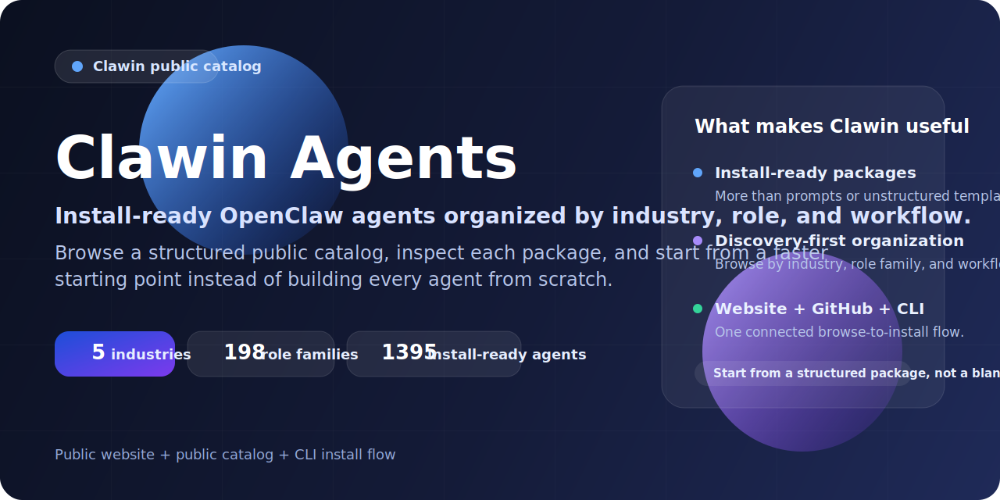

# 🧩 Clawin Agents — 可安装的 OpenClaw Agent Catalog

<p align="center">
  <strong>Language / 语言:</strong>
  <a href="./README.md">English</a>
  ·
  <a href="./README.zh-CN.md">简体中文</a>
</p>

<p align="center">
  
</p>

<p align="center">
  <a href="https://github.com/clawin-terry/clawin-agents/stargazers"></a>
  <a href="https://github.com/clawin-terry/clawin-agents/releases"></a>
  <a href="https://agents.clawin.club/"></a>
  <a href="./LICENSE"></a>
</p>

<p align="center">
  <strong>跳过空白工作区，直接从结构化 package 开始。</strong>
</p>

<p align="center">
  Clawin 是一个按行业、角色和真实工作流组织的 <strong>OpenClaw agent 公共目录</strong>。
  你可以先浏览、先检查 package 内容，再安装一个更快可用的起点，而不是从零搭建每一个 agent。
</p>

<p align="center">
  <a href="https://agents.clawin.club/catalog"></a>
  <a href="./INSTALL.md"></a>
  <a href="https://agents.clawin.club/"></a>
  <a href="https://github.com/clawin-terry/clawin-agents/stargazers"></a>
</p>

<p align="center">
  <a href="#-从哪里开始"></a>
  <a href="#-快速开始"></a>
  <a href="#-一个-package-里有什么"></a>
  <a href="#-常见问题"></a>
</p>

<table>
  <tr>
    <td align="center"><strong>1395</strong><br>install-ready agents</td>
    <td align="center"><strong>5</strong><br>industries</td>
    <td align="center"><strong>198</strong><br>role families</td>
    <td align="center"><strong>官网 + GitHub + CLI</strong><br>一条连贯的发现到安装流程</td>
  </tr>
</table>

> **一句话总结**
> - 按行业、角色族和工作流发现 OpenClaw agents
> - 安装前先检查 package 里到底包含什么
> - 不从 raw prompt 或空白 workspace 起步，而从结构化 package 起步
> - 通过官网 + GitHub catalog + CLI 构成完整的 discover-to-install 流程

---

## 目录

- [✨ 为什么是 Clawin](#-为什么是-clawin)
- [👥 Clawin 适合谁](#-clawin-适合谁)
- [⭐ 为什么这个仓库值得 Star](#-为什么这个仓库值得-star)
- [🚀 从哪里开始](#-从哪里开始)
- [🧭 核心亮点](#-核心亮点)
- [💡 你可以用 Clawin 做什么](#-你可以用-clawin-做什么)
- [⚡ 快速开始](#-快速开始)
- [🆚 为什么不从零开始](#-为什么不从零开始)
- [📦 一个 package 里有什么](#-一个-package-里有什么)
- [📊 当前公开目录状态](#-当前公开目录状态)
- [📈 Star 历史](#-star-历史)
- [❓ 常见问题](#-常见问题)
- [🧱 这个仓库是什么](#-这个仓库是什么)
- [⚖️ 许可证](#-许可证)

---

## ✨ 为什么是 Clawin

| 核心点 | 为什么重要 |
|---|---|
| **它是 install-ready 的，不只是 prompt** | 每个 package 不只是角色想法，也不是零散 prompt 片段 |
| **它是为了“发现”而组织的** | 可以按行业、角色族和 agent 身份带着目的浏览 |
| **它比从零搭建更快** | 先从结构化 package 起步，再按本地环境调整 |
| **它是一个完整系统** | 官网 + GitHub catalog + CLI 构成完整的发现到安装流程 |

> Clawin 的价值不只发生在“安装后”，也发生在“安装前的浏览”和“安装前的评估”阶段。

---

## 👥 Clawin 适合谁

| 人群 | 为什么适合 |
|---|---|
| **OpenClaw 用户** | 希望比从零搭建 agent 更快起步 |
| **开发者和技术团队** | 希望看到真实 package 结构，而不是抽象描述 |
| **运营、研究和业务团队** | 希望按工作流找到更结构化的 package |
| **GitHub 资源收藏者** | 希望收藏一个值得反复回看的 OpenClaw 资源入口 |

Clawin **不是**通用的零配置 AI App。它面向的是希望安装 OpenClaw agent package，并且希望更清晰地做选择的用户。

---

## ⭐ 为什么这个仓库值得 Star

如果你希望拥有一个可反复使用的 OpenClaw 资源入口，这个仓库值得 Star，因为它能帮助你：

| 原因 | 价值 |
|---|---|
| **跟踪目录增长** | 关注 Clawin 公共目录如何持续扩张 |
| **收藏结构化 package** | 当新需求出现时，回来快速挑选起点 |
| **先比较再安装** | 先看真实 package 结构，再决定是否安装 |
| **保留高质量生态入口** | 即使暂时不安装，也有收藏价值 |

---

## 🚀 从哪里开始

如果你还不知道先看哪一条路，可以直接从下面开始。

| 路线 | 适合谁 | 起点 |
|---|---|---|
| 开发者路线 | JS/TS、前端性能、Core Web Vitals | [`software-it-web-performance-engineer-js-ts`](./categories/industry-1-software-it/agents/engineering/software-it-web-performance-engineer-js-ts/) |
| 金融研究路线 | 公司研究、结构化分析工作流 | [`financial-research-company-research-analyst`](./categories/industry-6-financial-research/agents/equity-analysis/financial-research-company-research-analyst/) |
| 增长与营销路线 | 策略、归因、投放、SEO 类角色 | [Digital Marketing Agency](https://agents.clawin.club/industries/industry-4-digital-marketing-agency) |
| 内容平台路线 | 审核、创作者运营、政策、风险、平台产品类工作流 | [Content Media Platform](https://agents.clawin.club/industries/industry-5-content-media-platform) |
| 全量目录路线 | 想先看全貌的用户 | [Browse all agents](https://agents.clawin.club/catalog) |

### 推荐继续做成入口资产的 starter packs
- Beginner OpenClaw Starter Pack
- Developer Starter Pack
- Growth and Marketing Starter Pack
- Financial Research Starter Pack
- Ecommerce Operations Starter Pack
- Content Moderation Starter Pack

> 目录越大，就越需要这种“主题入口”，而不是让用户面对一张空白清单。

---

## 🧭 核心亮点

| 亮点 | 为什么重要 |
|---|---|
| **1395 个 install-ready agents** | 形成真实目录深度和很强的收藏价值 |
| **5 个行业 / 198 个角色族** | 让浏览更结构化，而不是随机堆叠 |
| **官网 + catalog + CLI** | 把发现、评估、安装串成一个系统 |
| **自包含 package 结构** | 给用户的不只是角色名或 prompt 片段 |
| **按 release 发布** | 让目录增长更可见，也更容易传播 |

### 按行业浏览
- [Software IT](https://agents.clawin.club/industries/industry-1-software-it)
- [Marketplace E-commerce](https://agents.clawin.club/industries/industry-3-marketplace-ecommerce)
- [Digital Marketing Agency](https://agents.clawin.club/industries/industry-4-digital-marketing-agency)
- [Content Media Platform](https://agents.clawin.club/industries/industry-5-content-media-platform)
- [Financial Research](https://agents.clawin.club/industries/industry-6-financial-research)

### 按入口浏览
- [网站目录浏览器](https://agents.clawin.club/catalog)
- [仓库目录总表](./CATALOG.md)
- [安装指南](./INSTALL.md)
- [Package 规范](./docs/shareable-folder-package.md)

---

## 💡 你可以用 Clawin 做什么

你可以在这些场景里使用 Clawin：
- 按行业和功能浏览角色型 agent
- 安装前先检查一个 package 是否适合你
- 在多个角色族之间做对比再决定路线
- 为新工作流或新实验整理 starter agent shortlist
- 从结构化 package 起步，而不是从 raw prompt 或空白 workspace 起步

### 典型用户路径
- “我想给 OpenClaw 找一个更强的起点”
- “我想看营销、研究、工程、审核等角色怎么组织”
- “我想先看 package 结构，再决定要不要装”
- “我想先收藏一个以后会用得上的 OpenClaw 资源仓库”

---

## ⚡ 快速开始

Clawin 的核心流程是 **browse -> inspect -> install**。

```bash
npm install -g agents.clawin
clawin init
clawin catalog refresh --catalog https://agents.clawin.club/releases/2026-03-18-p6-full-catalog-1395-agent/catalogs/published/catalog.json
clawin info software-it-web-performance-engineer-js-ts
clawin install software-it-web-performance-engineer-js-ts
clawin status software-it-web-performance-engineer-js-ts
```

### 这段流程实际在做什么
1. **安装 CLI**
2. **在本地初始化 Clawin**
3. **刷新当前 public catalog release**
4. **先检查一个 package**
5. **把它安装到你的 OpenClaw 环境里**
6. **检查本地结果并继续完成本地配置**

### 推荐第一装
- 软件/开发路线：`software-it-web-performance-engineer-js-ts`
- 研究路线：`financial-research-company-research-analyst`

完整步骤请看 [INSTALL.md](./INSTALL.md)。

---

## 🆚 为什么不从零开始

| 从零开始 | 从 Clawin 开始 |
|---|---|
| 面对一个空白 workspace | 从一个按角色设计好的起点开始 |
| 手动拼 package 结构 | 直接使用为安装设计的 package 结构 |
| skills 和文档要自己拼 | 先拿到完整 package 材料 |
| 先花时间决定该放什么 | 可以先检查一个具体 package |
| 不容易比较多个方案 | 可以先浏览结构化 public catalog |

Clawin 不是替代本地配置和判断，而是提供一个更好的起点。

---

## 📦 一个 package 里有什么

每个公开 package 的目标，都是成为一个可直接分享的 OpenClaw agent 文件夹。

| 组成部分 | 作用 |
|---|---|
| `README.md` | 说明角色定位和 package 意图 |
| `INSTALL.md` | 给出安装和本地后续步骤 |
| `PACKAGE.json` | 定义 package 元数据 |
| `workspace/` | 放角色相关的 workspace 材料 |
| `workspace/skills/` | 在需要时打包角色专属 skills |
| `config/` | 放面向安装的配置材料 |

Clawin package 的设计目标是 **自包含**。如果某个 agent 要真正发挥作用需要 skills，这些 skills 就应该跟 package 一起提供，而不是让用户自己拼。

这也是 Clawin 和下面这些东西的区别：
- raw prompt 库
- 松散模板集合
- 没有安装路径的角色列表

正式规范见：
- [docs/shareable-folder-package.md](./docs/shareable-folder-package.md)

---

## 📊 当前公开目录状态

| 指标 | 数值 |
|---|---:|
| 行业数 | 5 |
| 角色族 | 198 |
| 可安装 agents | 1395 |
| 当前 public release | `2026-03-18-p6-full-catalog-1395-agent` |

### 按行业拆分
- `industry-1-software-it` — **394**
- `industry-3-marketplace-ecommerce` — **355**
- `industry-4-digital-marketing-agency` — **283**
- `industry-5-content-media-platform` — **311**
- `industry-6-financial-research` — **52**

完整角色族和 agent 清单见 [CATALOG.md](./CATALOG.md)。

---

## 📈 Star 历史

[](https://www.star-history.com/#clawin-terry/clawin-agents&Date)

---

## ❓ 常见问题

### 我必须先有 OpenClaw 吗？
是。Clawin 面向已经在用、或准备使用 OpenClaw 的用户。

### 这些是 prompt 还是 install-ready package？
这些是面向 OpenClaw 的 install-ready agent package，不只是 raw prompt。

### 我还需要做本地配置吗？
需要。Provider API keys、本地环境设置、recipient bindings 以及其他机器相关配置，都应该保留在本地。

### 我可以先浏览，不安装吗？
可以。你可以先看官网目录、仓库里的 package 文件夹，或者先读 `CATALOG.md` 再决定。

### 最容易开始试的 agent 是哪个？
默认软件路线：
- `software-it-web-performance-engineer-js-ts`

默认研究路线：
- `financial-research-company-research-analyst`

---

## 🧱 这个仓库是什么

| 这个仓库是 | 这个仓库不是 |
|---|---|
| Clawin 的 public output catalog | 私有生产流水线 |
| 浏览可安装 OpenClaw agents 的入口 | 原始角色源文档仓 |
| 按角色和领域选择 package 的公共入口 | 内部 review 队列或私有 run 日志仓 |
| 已发布 package 的公开安装面 | 生产环境细节记录 |

### 仓库布局

```text
categories/<industry-id>/agents/<role-family-key>/<agentId>/
```

这个仓库刻意保持简单：
- `categories/` — 公共可安装 agent packages
- `docs/` — 公共 package 规范
- 顶层文档 — 安装与目录导航

### 公私分离发布模型

Clawin 采用 **private-source / public-output** 模型：
- 私有仓：生产流水线、specs、review 产物、生成流程
- 公开仓：只放经过整理的可安装 agent packages

这样可以让 public catalog 更干净，同时保留私有生产系统继续演进的空间。

---

## 🔗 最后入口

**[浏览完整目录 →](https://agents.clawin.club/catalog)** · **[阅读安装指南 →](./INSTALL.md)** · **[访问官网 →](https://agents.clawin.club/)** · **[Star 这个仓库 →](https://github.com/clawin-terry/clawin-agents/stargazers)**

---

## ⚖️ 许可证

仓库级别的 Clawin 自有 catalog 内容采用 **Apache License 2.0**。

由于部分 package 可能包含 bundled skills 或嵌入的上游组件，也请同时阅读：
- [LICENSE](./LICENSE)
- [NOTICE](./NOTICE)
- [THIRD_PARTY.md](./THIRD_PARTY.md)

如果某个 bundled 组件自带 license 文件或 origin metadata，请以该组件自己的条款为准。

## Notes

- 所有 secrets 都刻意排除在仓库外。
- 用户需要自行提供本地 provider 配置。
- 这些 package 设计目标是通过 catalog 驱动 OpenClaw 安装，而不是作为独立 app 运行。
- 后续 release 会继续把私有源仓里生成的优质 agent 输出到这个 public catalog。
